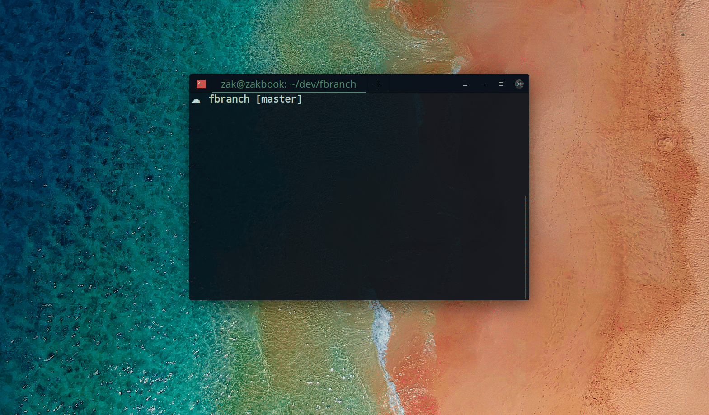

## fbranch

This is a cli tool to quickly switch between git branches



## Install

```sh
npm install --global fbranch
```

## Usage

To fuzzy search and checkout a branch by query

```sh
fbranch <query>
```

To search and checkout interactively

```
fbranch -i
```
